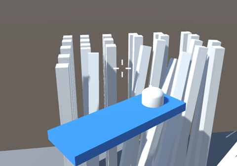
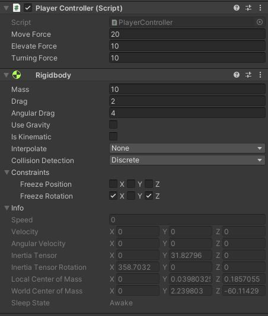
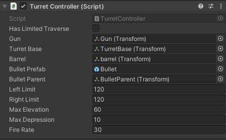
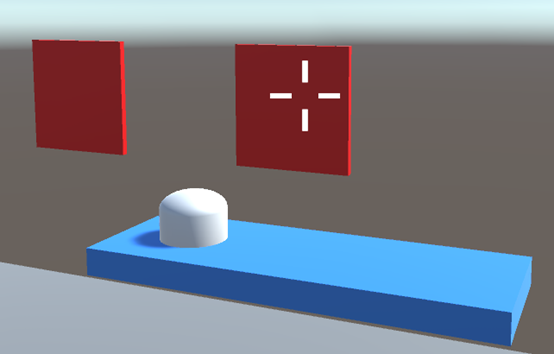

#AirShipGameSample
A simplified version of my airship game.
Using Input system and cinemachine.
Have moving, elevating, basic turret funtion, shooting, simple enemy health point.
#Moving

Using ridgybody to move around.
You can change moving, turning speed and drag in Inspector.
#Turret

Gun only fire when turret is aim.Custom limit turret traverse angle, elevation, depression and fire rate(rpm).
#Enemy

Simple enemy health point system.
Enemy will take damage when hit.If HP drop to 0 enmy will destory.

